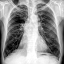

# CXR-super-resolution
## Accelerating Super-Resolution and Visual Task Analysis in Medical Images

Medical images are acquired at different resolutions based on clinical goals or available technology. In general, however, high-resolution images with fine structural details are preferred for visual task analysis. Recognizing this significance, several deep learning networks have been proposed to enhance medical images for reliable automated interpretation. These deep networks are often computationally complex and require a massive number of parameters, which restrict them to highly capable computing platforms with large memory banks. In this paper, we propose an efficient deep learning based super resolution approach that simultaneously reduces computational complexity and improves performance. The super-resolution model learns the mapping from low-resolution to high-resolution images. It has a simple architecture that is trained using multiple scales at once to minimize a proposed learning-loss function. 

Scaled low resolution image    |  Super-resolution image
:-------------------------    :|:    -------------------------:
  |  

  
  

## Simplicity and Stability:

Our customized single image super-resolution (SISR) model, inspired by VDSR (20 conv. layers), has a shallower structure (7 conv. layers) with a lower number of training parameters. In addition, our proposed SISR model is easy to train and has a single network contrary to GAN-based networks which are difficult to train and require both generator and discriminator networks. Further, our proposed model is more stable and less sensitive to hyper-parameters selection as compared to most GAN-based models. As large models with massive number of parameters are restricted to computing platforms with large memory banks and computing capability, developing smaller and stable networks without losing representative accuracy is important to reduce the number of parameters and the storage size of the networks. This would boost the usage of these networks in limited-resource settings and embedded healthcare systems.

## Multiple Scales Training: 

Our SISR model is trained with different scale factors at once. The trained network can then be tested with any scale used during training. Training a single model with multiple scale factors is more efficient, accurate, and practical as compared to training and storing several scale-dependent models.

## Context: 

We utilize information from the entire image region. Existing methods either rely on the context of small image regions, but not the entire image region. Our experimental results demonstrate that using the entire image region leads to better overall performance while decreasing computations.

## Raw Image Channels: 

We propose to compute the residual image from the raw image (RGB or grayscale) directly instead of converting the images to a different color space (e.g., YCbCr). The residual image is computed by subtracting the HR reference image from the LR image that has been upscaled using interpolation to match the size of the reference image. The computed residual image contains information of the image’s high-frequency details. The main benefit of directly working on the raw color space is that we decrease the total computational time by dropping two operations: (1) converting from raw color space to another color space (e.g., YCbCr) and (2) converting the image back to its original color space. Our customized SISR model computes the residual images directly from the original color space and learns to estimate these images. To construct an HR image, the estimated residual image is added to the upsampled LR image.

## Combined Learning Loss: 

We propose to train the proposed SISR model using a loss function that combines the advantages of the mean absolute error (MAE) and the Multi-scale Structural Similarity (MS-SSIM). Our experimental results show that MAE can better assess the average model performance as compared to other loss metrics. Also, our experimental results show that
the MS-SSIM preserves the contrast in high-frequency regions better than other loss functions (e.g., SSIM). To capture the best characteristics of both loss functions, we propose to combine both loss terms (MAE + MS-SSIM).

## Citation: 

If you are using these codes for your research, kindly cite this publication where the details of the proposed aoproach are discussed and evaluated. 

## Zamzmi, G.; Rajaraman, S.; Antani, S. Accelerating Super-Resolution and Visual Task Analysis in Medical Images. Appl. Sci. 2020, 10, 4282.
